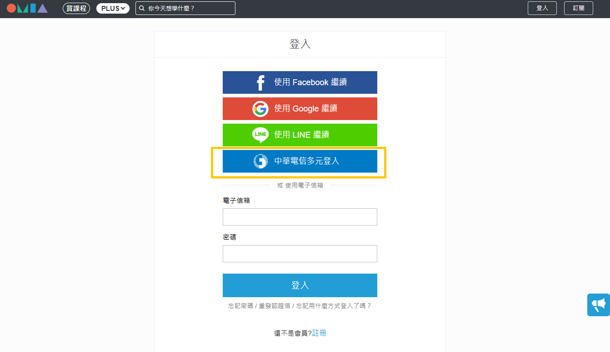

# OMIA PLUS訂閱成功後，如何登入？

一、中華電信網路門市申辦OMIA PLUS

❶敬請於OMIA PLUS官網https://www.omia.com.tw/plus →\[登入]→點選\[中華電信多元登入]

<figure><figcaption></figcaption></figure>

❷簡訊驗證碼登入，輸入學員訂閱OMIA PLUS服務之手機門號進行登入

<figure><figcaption></figcaption></figure>

❸登入後，觀看課程

<figure><figcaption></figcaption></figure>

<figure><figcaption></figcaption></figure>

<figure><figcaption></figcaption></figure>

二、OMIA PLUS官網訂閱

❶敬請於OMIA PLUS官網https://www.omia.com.tw/plus →\[登入]

登入您訂閱課程使用之OMIA PLUS會員帳號

<figure><figcaption></figcaption></figure>

❷登入後，觀看課程

<figure><figcaption></figcaption></figure>

<figure><figcaption></figcaption></figure>

<figure><figcaption></figcaption></figure>

