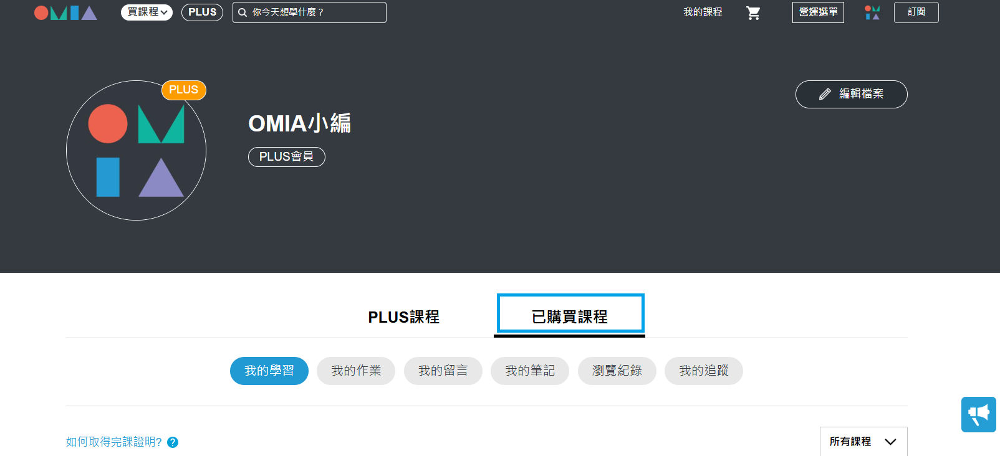
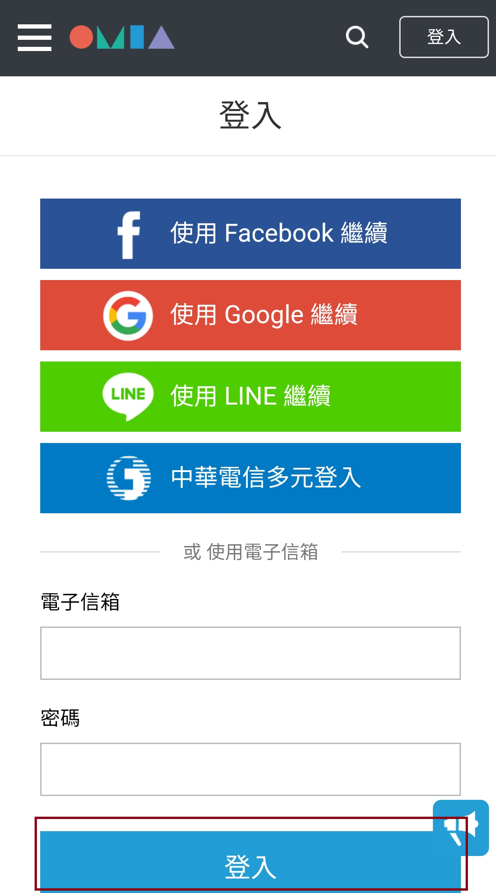
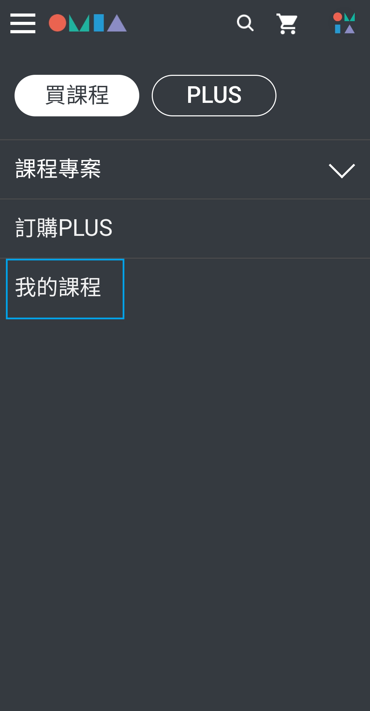
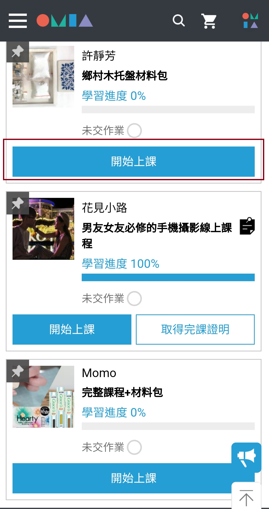

# 訂閱成功後，如何觀看課程影片？

一、電腦版

❶敬請學員使用電腦版Google Chrome瀏覽器，開啟OMIA官網

&#x20;→右上方\[登入] →登入您訂閱課程使用之OMIA會員帳號

<figure><figcaption></figcaption></figure>

<figure><figcaption></figcaption></figure>

❷登入後，右上方點選\[我的課程]→\[已購買課程]→\[我的學習]→點擊\[開始上課]按鈕，觀看課程。

<mark style="color:blue;">※</mark><mark style="color:blue;">**電腦設備，作業系統版本最低支援:**</mark>

▶<mark style="color:blue;">**Windows系統需求:Windows 10以上。**</mark>

▶<mark style="color:blue;">**Mac OS系統需求:Mac OS 10.14 以上。**</mark>

<figure><figcaption></figcaption></figure>

<figure><figcaption></figcaption></figure>

<figure><figcaption></figcaption></figure>

二、手機版

❶敬請學員使用手機版Google Chrome瀏覽器，開啟OMIA官網

→右上方\[登入]  →登入您訂閱課程使用之OMIA會員帳號

<figure><figcaption></figcaption></figure>

<figure><figcaption></figcaption></figure>

❷登入後，點選左方\[三條橫線]圖示→\[我的課程]→\[已購買課程]→\[我的學習]

→點擊\[開始上課]按鈕，觀看課程。

<figure><figcaption></figcaption></figure>

<figure><figcaption></figcaption></figure>

<figure><figcaption></figcaption></figure>

<figure><figcaption></figcaption></figure>
