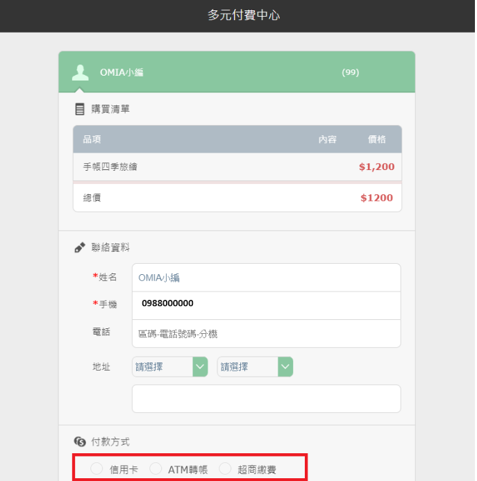

# 國內付款方式？

提供信用卡、匯款、ATM轉帳、超商繳費四項付款方式。在交易過程中，可選擇欲付款的方式。

信用卡無限制卡別，不論是Visa、Master、JCB，皆可付費購課。

<figure><figcaption></figcaption></figure>

若您有匯款的需求，請持以下資訊至郵局／銀行臨櫃辦理。

\
匯款代號：006（合作金庫）、 西湖分行5104  \
戶名：春水堂科技娛樂股份有限公司\
帳號：5104717 016830  \
\
匯款完成後，請將以下資訊發送至OMIA客服中心[contact@omia.com.tw](mailto:contact@omia.com.tw)，以利OMIA進一步確認您的訂單。待確認收到您的帳款後，OMIA將提供您「課程序號」兌換學習。

1.繳款者戶名 2.付款銀行 3.匯款日期 4.匯款金額 5.帳號末5碼 6.發票收件地址 7.聯絡電話
