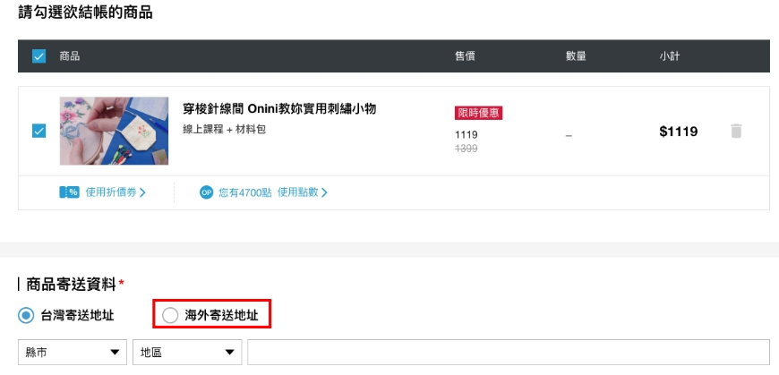

# 我住海外，可以訂購附材料包的課程嗎？

目前 OMIA 僅有部分材料及用具支援海外寄送服務（需支付海外運費）。您可以在將商品加入購物車後，於結帳頁面確認有&#x7121;**「海外寄送運費加計」**&#x7684;選項，若可加選，代表此商品支援寄送海外。加計有寄送至各國的所需運費可以查閱／選擇，在您購課時，系統會自動加上應負擔的運費金額。

<figure><figcaption></figcaption></figure>
